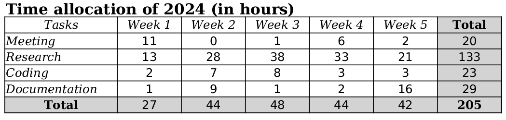

# Work time allocation generator

If you need to report to your company, to your client, for a project, your working hours based on a task distribution, this script is for you !

Define the number of task, the associated distribution, the legal working hours constraints applicable to your company and obtain an excel file with a table of work hours for each task for each week that seems plausible and with enough diversity to generate multiple different reports for different person.

## Usage

Create a config json file (see example in `config_example.json`) and then run the script : 

```python
poetry run python main.py <config_file_name>
```

You can also specify a file prefix as second argument to save the output files in a specific folder.

Example of output file over 4 weeks with the following distribution `[0.0, 0.0, 0.2, 0.0, 0.3, 0.4, 0.1]` : 



Note that the output excel has embedded formula for the totals.

## Install

```python
poetry install
```

## Options

- `year`: The target year for hours allocation.
- `min_week_hours`: The minimum number of hours per week.
- `max_week_hours`: The maximum number of hours per week.
- `average_week_hours`: The desired average number of hours per week. Each week hours is generated based on a normal distribution centered on this value.
- `average_rolling_week_hours`: The desired average number of hours per week over a rolling period of weeks. In some state you cannot work more than X hours in average over Y weeks.
- `tracking_rolling_weeks`[optional, default=1]: The number of weeks to consider for the rolling average. If set to default, the the constraint is ignored and the `average_rolling_week_hours` is set to `max_week_hours`.
- `max_yearly_overtime`: The maximum number of hours of overtime per year.
- `yearly_overtime_variance`: The variance of the number of hours of overtime per year (to introduce some randomness).
- `number_working_days`[optional, default=5]: The number of working days per week.
- `project_names`: The list of project names.
- `start_date`: The start date of the allocation period.
- `end_date`: The end date of the allocation period. Note that 30/12 and 31/12 are the first week of the next year, thus stop it at 28/12.
- `project_distribution`: The distribution of hours across tasks (must sum to 1) and same length as `project_names`.
- `working_days`[optional, default=5]: The list of working days per week.
- `date_format`[optional, default="%d/%m"]: The format of the date.
- `holidays`: The list of holidays, leaves, ... in format without the year. Concatenate `=m` to make this holiday as half day (for example `30/10=m`).

## Principles

- First the script generate a random allocation using a normal distribution of hours for each week taking into account the holidays and the working days.
- It then iterate over a sliding window of weeks of the size of `tracking_rolling_weeks` and adjust the hours to meet the average weekly hours constraint b y scaling down the weeks' hours and it also ensure that each week hours meet the minimum hours requirement.
- Then for each week in the sliding window, it distribute the hours across tasks using a dirichlet distribution.
- Then it round the hours to the nearest integer and ensure compliance with the requirements by adding or substracting integer amount of hours.
- Then it check that the total yearly hours do not exceed the maximum yearly hours and adjust the hours to meet this constraint.

## Parameters

- `normal_distribution_factor`: The factor of the normal distribution. If not specified, it is calculated as `(max_week_hours - min_week_hours)/3`. It is used to set the standard deviation for the normal distribution for weekly hours.
- `dirichlet_factor`: The factor of the dirichlet distribution. If not specified, it is calculated as `(max_week_hours - min_week_hours)/3`. It is used to set the factor for the dirichlet distribution for task distribution (attribution of the total hours in a specific week to each task).


## Notes :
- The final average weekly hours is not exactly the `average_week_hours` because of the rounding and the scaling down of the weeks' hours. It is also influenced by the `yearly_overtime_variance` parameter which take over the control of the final average weekly hours. Thus both parameters are interdependent and should be adjusted together.
- The `yearly_overtime_variance` parameter is used to introduce some randomness in the yearly overtime. It is not used to control the final average weekly hours, nor the minimum yearly overtime. In fact, there is no control on the minimum yearly overtime except by tweaking the average weekly hours constraint but without fine grain control.
- For hour contract that have a fixed number of hours per week, set `min_week_hours=max_week_hours=average_week_hours=min_week_hours`. It will generate the same number of hours per week for each week with random distribution across tasks. Then if needed manually adjust the hours to meet the minimum yearly overtime constraint (which is the only constraint that is not met).
- You can find the legal constraints for France [here](https://www.economie.gouv.fr/entreprises/heures-supplementaires-salaries-prive)